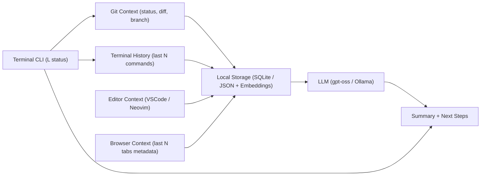

# Project-L Development Plan

> **An intelligent multi-modal development context agent that remembers what you were working on.**

## Table of Contents

1. [Overview](#overview)
2. [Development Phases](#development-phases)
    - [Phase 1: Core CLI MVP](#phase-1-core-cli-mvp)
    - [Phase 2: Editor Integration](#phase-2-editor-integration)
    - [Phase 3: Browser Intelligence](#phase-3-browser-intelligence)
    - [Phase 4: Multi-Modal Context Linking](#phase-4-multi-modal-context-linking)
    - [Phase 5: Smart Recommendations](#phase-5-smart-recommendations-agentic-layer)
    - [Phase 6: Team Collaboration Mode](#phase-6-team-collaboration-mode)
3. [Technology Stack](#technology-stack)
4. [Architecture Overview](#architecture-overview)
5. [Getting Started](#getting-started)

---

## Overview

Project-L is an intelligent development assistant that captures and recalls your coding context across multiple dimensions - git history, terminal commands, file edits, and browser research. It provides natural language summaries of your work state and suggests logical next steps.

**Key Features:**
- **Context Awareness**: Tracks git, terminal, editor, and browser activity
- **Natural Language Summaries**: Converts technical context into readable insights
- **Smart Recommendations**: Suggests next steps based on your workflow patterns
- **Multi-Modal Integration**: Seamlessly connects different development tools
- **Team Collaboration**: Share context and handoffs with team members

---

## Phases Planned

🟢 Phase 1 – Core CLI MVP

> **Goal:** I want a terminal command (`L status`) that recalls what I was last working on.

**Inputs:**
  - Git context → `git status`, `git diff --stat`, current branch.
  - Terminal history → last 10 commands (via `history`).

**Outputs:**
> *“I was working on branch `feature/async-batch`, editing `views.py`, last commit message: ‘added polling for progress bar’. I ran `pytest` and `docker-compose up`. Next step: integrate Celery task retries.”*

**Implementation:**
  - CLI built with `Typer` or `Click`
  - Storage: local SQLite / JSON for session memory
  - Processing: embeddings (`FAISS`/`Chroma`) to store recent activity
  - LLM (`gpt-oss` / `llama.cpp` / `Ollama`) to generate the summary + next steps

🟡 Phase 2 – Editor Integration

> **Goal:** Capture **what files and functions I’ve been editing** inside my IDE.

**Integration options:**
  - VSCode → use [VSCode Extension API](https://code.visualstudio.com/api) to log active file, cursor location, unsaved edits
  - Neovim/Vim → capture buffer activity via plugins

**Flow:**
> *“I spent 45 minutes editing `tasks/celery_worker.py`, last function touched: `process_sbom_import`.”*
> This gets linked with my terminal/git context.

**Output improvement:**
> When I type `L status` →
> *“I last edited `celery_worker.py`, ran `pytest tests/test_import.py`, and switched to Chrome tab `NVD Vulnerability Search`. I stopped before handling retries.”*

🔵 Phase 3 – Browser Intelligence

> **Goal:** Capture my research context (docs, GitHub issues, StackOverflow, Jira).

**Integration options:**
  - Browser extension (Chrome/Firefox) that logs last 5 active tabs + titles
  - Keep it lightweight → only store metadata, not full history

**Flow:**
> Example tabs: “NVD CVE-2025-12345”, “Django Celery best practices”, “DefectDojo GitHub Issues #5800”
> The agent summarizes this browsing context into actionable dev tasks

🟣 Phase 4 – Multi-Modal Context Linking

> **Goal:** Combine all signals into a single **“What was I doing?” report**

**Data Sources:**
  - Git (diffs, commits, branches)
  - Terminal (last N commands)
  - Editor (files & functions)
  - Browser (last tabs)

**LLM Orchestration:**
  - Use **LangGraph** to build a workflow:
    - Node 1: Collector agents (git, terminal, editor, browser)
    - Node 2: Aggregator → merges into structured JSON timeline
    - Node 3: LLM summarizer → outputs natural summary + recommended next steps

🟠 Phase 5 – Smart Recommendations (Agentic Layer)

> **Goal:** Project-L should not just summarize — it should **recommend my next steps**

**Examples:**
> *“You haven’t run `pytest` since editing `celery_worker.py`. Run tests now.”*
> *“You opened DefectDojo issue #5800 but haven’t updated your branch. Consider referencing the issue in your commit.”*

**Implementation:**
  - Add rule-based + LLM-based reasoning
  - Fine-tune prompts on my workflows (and later, team workflows)

🟤 Phase 6 – Team/Collaboration Mode

> **Goal:** Evolve Project-L from a personal agent → team productivity tool

**Features:**
  - Share my “What was I working on?” with teammates
  - GitHub/Jira integration: auto-link local context to open issues
  - Slack/Teams integration:
    > *“Yazat paused work on `async batch` at 5:30PM, pending task: implement retries.”*

---

## Technology Stack

### Core Infrastructure

| Component | Technology | Purpose |
|-----------|------------|---------|
| **CLI Framework** | `Typer` or `Click` | Command-line interface and argument parsing |
| **Data Storage** | `SQLite` + `ChromaDB`/`FAISS` | Local persistence and vector embeddings |
| **LLM Runtime** | `Ollama`, `llama.cpp`, or cloud APIs | Natural language processing and generation |
| **Orchestration** | `LangGraph` | Multi-agent workflow coordination |
| **Configuration** | `YAML`/`TOML` + `Pydantic` | Settings management and validation |

### Integration Libraries

| Integration | Library/API | Notes |
|-------------|-------------|--------|
| **Git** | `GitPython` | Repository analysis and history tracking |
| **Terminal** | Shell hooks + `psutil` | Command history and process monitoring |
| **VSCode** | Extension API | Real-time editor activity tracking |
| **Neovim** | Lua plugin + `msgpack` | Buffer and LSP integration |
| **Browser** | Manifest V3 extension | Tab monitoring and research context |

---

## Phase 1–3 Architecture

